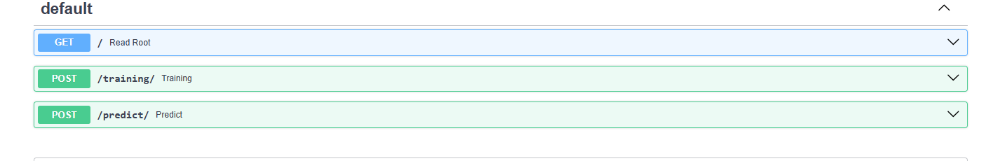
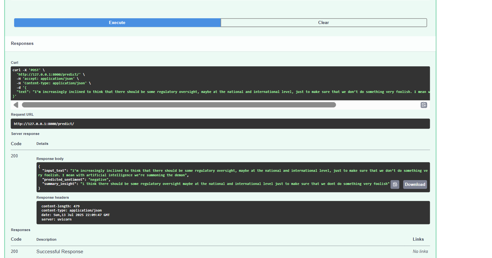

# Sentiment Analyzer & Summary


- **Main GitHub:** [puskal-khadka](https://www.github.com/puskal-khadka)

<p align="center">

  

</p>  


## Installation

Follow the following steps below to build the project on your machine:

### 1. Clone the Repository

```bash
git clone https://github.com/Puskal12345/Sentiment-Analyzer-Summarizer.git
cd Sentiment-Analyzer-Summarizer
```
### 2. Create a Virtual Environment

```
python -m venv venv
```

### 3. Activate the Virtual Environment
Windows:

```bash 
venv\Scripts\activate

```
Linux/macOS:

```bash

source venv/bin/activate
```
### 4. Install dependencies
```bash
pip install -r requirements.txt
```
### 5. Running the Application
To start FastAPI server:

```bash
uvicorn main:app --reload
```
Once the server is running, navigate to:

```bash
http://127.0.0.1:8000/docs
```
This will open the interactive Swagger docs for testing API endpoints.

### 6. Using Pre-trained Model
I already train the model in the train dataset and shared model weight. So you can direct inference from that
- Download the pre-trained model weights from the Releases section [here](https://github.com/Puskal12345/Sentiment-Analyzer-Summarizer/releases/download/v1.0/model_state.pth).

- Place the model weights into the following path:

```bash
saved/model_state.pth
```
- Open your browser and navigate to:

```bash
http://127.0.0.1:8000/docs
```
Use the ```/predict``` endpoint to test sentiment predictions on your input text.

### 7. Training the Model
Once app run, navigate to

```bash
http://127.0.0.1:8000/docs
```
Use the ```/training``` endpoint to initiate model training. Training logs and metrics will be show in the log respectively and final trained model will be saved in ```saved/model_state.pth``.

